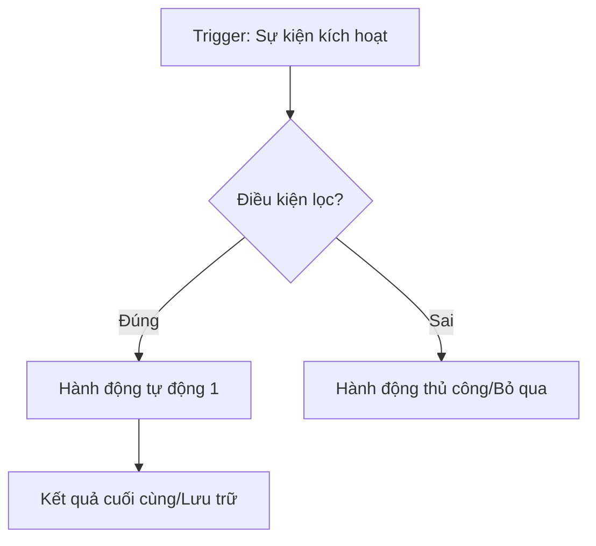

# 💎 Quy chuẩn Đầu ra (Output Standards)

Tài liệu này định nghĩa các tiêu chuẩn mà AI phải tuân thủ khi thực thi các kỹ năng trong bộ Solo Business Skills.

## 1. Phong cách Ngôn ngữ (Tone of Voice)
- **Primary Style**: `viet-viet` (Hạ Hồng Việt).
- **Đặc trưng**: Câu ngắn, xuống dòng thường xuyên, có cú xoay (pivot) phản biện, thực tế, không lý thuyết suông.
- **Cấm**: Dùng các cụm từ sáo rỗng như "Trong bối cảnh hiện nay", "Chúng ta cần phải", "Một trong những yếu tố quan trọng là".

## 2. Trình bày Trực quan (Visualization)
- **Quy trình/Workflow**: Bắt buộc dùng Mermaid Diagram.
- **So sánh/Lựa chọn**: Dùng bảng (Markdown Table).
- **Action Plan**: Dùng checkbox list `- [ ]`.

## 3. Cấu trúc Nội dung (Content Structure)
- **Hook**: Phải sử dụng framework 5T (STAR-T).
- **Body**: Phải cung cấp giá trị VALUE (Vexaty, Aspire, Liability, Urgent, Expect).
- **CTA**: Phải có ít nhất một lời kêu gọi hành động cụ thể và đo lường được.

## 4. Công cụ & Giải pháp (Tooling)
- Luôn ưu tiên giải pháp **No-code/Low-code** (Make, Zapier, Carrd, Notion).
- Đề xuất công cụ cụ thể kèm theo lý do tại sao nó phù hợp với nguồn lực hiện tại của user.

---

## Mẫu Mermaid chuẩn cho Solopreneur Workflow:

